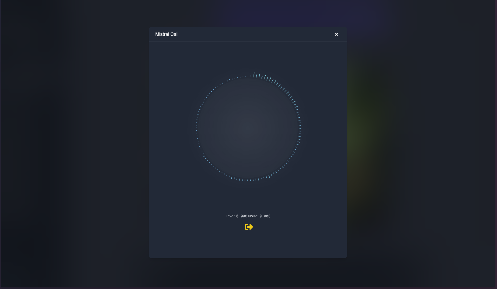

# MistralChat — Open Assistant (Unofficial)

A polished, self-hostable chat application that uses Mistral AI models to power responses. 
It includes Google authentication, per-user threads, server-issued access tokens stored as secure HTTP-only cookies, 
and a minimal admin/persistence layer using Prisma + MySQL.

---

## Table of Contents

- [Overview](#overview)
- [Introduction](#introduction)
- [Demo & User Guide](#demo--user-guide)
- [Prerequisites](#prerequisites)
- [Installation & Setup](#installation--setup)
- [Project Structure](#project-structure)
- [API Reference](#api-reference)
- [Authentication Flow](#authentication-flow)
- [Roadmap](#roadmap)
- [Documentation / Help Center](#documentation--help-center)
- [Contributing](#contributing)
- [Acknowledgements](#acknowledgements)
- [Contact](#contact)
- [License](#license)

---

## Overview

**Project name:** MistralChat — Open Assistant (Unofficial)

This repository is a demonstration chat application built on top of Mistral AI (community SDK). 
It is aimed at developers who want a self-hosted, extensible chat UI that supports:

- Google OAuth sign-in
- Server-issued access tokens (stored in a database)
- Threaded conversations saved per user
- Integration with Mistral AI models (via `@mistralai/mistralai`)
- Prisma for data persistence

---

## Introduction

MistralChat is a lightweight chat UI and backend stack that demonstrates how to implement authentication, 
data persistence, and model-powered chat responses. 
The app is ideal for prototyping, internal tools, and experimenting with LLMs.

**Target audience:** Anyone who already uses LLMs or wants to experiment with them.

---

## Demo & User Guide

Quick demo (server): 
 
1. Visit [`https://chatbot.infuseting.fr`](https://chatbot.infuseting.fr/) and sign in with Google.
2. Get your [API key](https://admin.mistral.ai/organization/api-keys) from Mistral.
3. Create or open threads, send messages, and view model responses.

**Tip:** Use the `Share` feature to open a shared thread URL.

### Screenshots

**Home Page**  


**Model Configuration Page**  
Here you can set your [API key](https://admin.mistral.ai/organization/api-keys), 
choose models from a fast list, and define a default model for all threads.  


**Fast Config**  
Quickly modify the context and model for the current thread.  


**Voice call**
Use you're voice to talk with AI.


**Image Generation**
Generate image from text or other image


---

## Prerequisites

- Node.js (v18+ recommended)
- npm (or pnpm/yarn)
- A database supported by Prisma (MySQL recommended)
- Google OAuth credentials (Client ID) configured for `http://localhost:3000` redirect
- A Mistral [API key](https://admin.mistral.ai/organization/api-keys)

---

## Installation & Setup

1. **Clone the repository:**

```bash
git clone https://github.com/Infuseting/ChatBOT_MistralAI.git
cd ChatBOT_MistralAI
```

2. **Install dependencies:**

```bash
npm install
```

3. **Create a `.env` file** in the project root with the following variables:

```env
DATABASE_URL="mysql://<username>:<password>@<url>:<port>/chatbot"
NEXT_PUBLIC_GOOGLE_CLIENT_ID=your-google-client-id
TTS_API_KEY=your-tts-api-key
NODE_ENV=development
```

To get a valid api key for my TTS api you can [contact me](mailto:serretarthur@gmail.com) or just test by yourself with the [official website](https://chatbot.infuseting.fr) (TTS key is required to use the voice chat and video chat but you can use this program without having TTS API KEY)

4. **Prisma setup (run migrations):**

```bash
npx prisma generate
npx prisma migrate dev
```

5. **Start the development server:**

```bash
npm run dev
```

6. Open `http://localhost:3000` and sign in.

---

## Project Structure

Top-level structure:

```
src/
  app/
    api/            # Next.js API routes (auth, user, thread, validate)
    components/     # React components (Chatbot, Navbar, Modals...)
    login/          # Login page
    layout.tsx      # App root layout
  lib/
    prisma.ts       # Prisma client
  utils/            # Helpers (User, Thread, Messages...)
  middleware.ts     # Auth middleware for validating tokens
```

---

## API Reference

The project exposes a set of Next.js API routes under `src/app/api`. Below are the main endpoints and a short description of their behavior. All server-side tokens used by these routes are stored in the database and may be supplied either via the `Authorization: Bearer <token>` header or the `access_token` httpOnly cookie.

- `POST /api/auth/google/token` — Exchange a Google OAuth `access_token` (obtained on the client) for a server-side access token. Verifies Google tokeninfo, upserts the user by `googleId`, and sets a secure, httpOnly `access_token` cookie on success.
- `POST /api/auth/logout` — Logs out the current user: deletes the server-side token(s) matching the provided token and clears the `access_token` cookie.
- `DELETE /api/auth/delete` — Permanently deletes the authenticated user's account and related data (messages, threads, shares, tokens). Requires authentication.
- `POST /api/auth/email/login` — Email/password login. Accepts `{ email, password }` JSON body. On success returns `{ ok: true }` and sets an `access_token` cookie.
- `POST /api/auth/email/register` — Email/password registration. Accepts `{ email, password, name? }`. Creates a user (provider = 'MDP'), issues an `access_token` cookie on success.
- `GET /api/auth/validate` — Validates the provided server-side token and returns `{ ok: true }` when valid. Useful for middleware and client-side checks.

- `GET /api/user` — Returns basic profile information for the authenticated user (id, name, picture). Requires a valid server token.

- `GET /api/thread` — Multi-purpose GET that supports:
  - `?shareCode=CODE` — Return a publicly-shared thread by share code (no auth required).
  - `?idThread=ID` — Return a specific thread and its messages if the requester is the owner (requires auth). Supports `limit` and `before` for paginated message loading.
  - no query params — List threads for the authenticated user (supports `limit` and `before`).

- `POST /api/thread` — Multi-action endpoint. The request JSON should include an `action` field with one of the following values:
  - `create` — Create a new thread. Body: `{ action: 'create', data: { ... } }`. Requires auth.
  - `share` — Create or fetch a share code for an owned thread. Body: `{ action: 'share', idThread }`. Requires auth and ownership.
  - `sync` — Bulk-insert/sync messages for existing threads (used for imports/sync). Body: `{ action: 'sync', messages: [...] }`. Only inserts messages that target known threads and are permitted (owner or shared).
  - `update` — Update thread metadata (name, context, model). Body: `{ action: 'update', idThread, data: { ... } }`. Requires auth and ownership.

- `POST /api/tts` — Server-side TTS proxy. Supports two actions in the body:
  - `{ validate: true }` — Validates the server TTS API key with the provider.
  - `{ text: string, lang?: string }` — Generates audio (mp3) via the configured provider and returns audio bytes (`Content-Type: audio/mpeg`). Uses the server's configured TTS API key.

Notes:
- Many endpoints accept the server-side token via `Authorization: Bearer <token>` or the `access_token` cookie. The cookie is httpOnly and set on successful login/registration.
- Error responses follow a JSON shape like `{ error: 'Message' }` and appropriate HTTP status codes (401 for auth failures, 400 for bad requests, 500 for server errors).

---

## Authentication Flow

There are two primary sign-in flows supported by the app: Google OAuth and traditional email/password. Both flows result in a server-side access token which is persisted in the database and returned to the client as a secure, httpOnly cookie (`access_token`). API routes and middleware validate requests using this server-side token.

Google OAuth:

- The client obtains a Google OAuth `access_token` on the client (via Google Sign-In).
- The client POSTs `{ access_token }` to `/api/auth/google/token`.
- The server verifies the token with Google's tokeninfo endpoint, upserts the user by `googleId`, creates a local server-side access token in the DB, and sets an httpOnly `access_token` cookie on success.

Email/password:

- The client POSTs `{ email, password }` to `/api/auth/email/login` to sign in. If successful, the server creates a server-side access token and sets the `access_token` cookie.
- New users can register via `POST /api/auth/email/register` with `{ email, password, name? }`, which creates the user and issues the cookie.

Logout / token management:

- `POST /api/auth/logout` deletes server-side token(s) that match the supplied token and clears the cookie.
- `DELETE /api/auth/delete` performs a destructive deletion of the authenticated user's account and related data (requires authentication).

Token usage:

- API routes accept the server token either as `Authorization: Bearer <token>` or via the `access_token` httpOnly cookie. The cookie is preferred in browser flows to avoid exposing tokens to JS.

Security Notes:

- Access tokens are stored server-side and sent as httpOnly cookies to reduce XSS risk.
- The server-side tokens are short-lived by design (if `expiresAt` is set) and validated against the DB by `GET /api/auth/validate`.
- For very large deployments, consider switching to signed JWTs or an introspection-capable auth layer to avoid DB lookups in hot paths.

---

## Roadmap

| Feature | Smartphone | Tablet | Computer |
|:--------|:----------:|:------:|:--------:|
| Remote Storage | ✅ | ✅ | ✅ |
| Thread Management | ✅ | ✅ | ✅ |
| Responsive Design | ✅ | ✅ | ✅ |
| Model & Context Configurator | ✅ | ✅ | ✅ |
| Google OAuth Login | ✅ | ✅ | ✅ |
| Deep Think Integration | ✅ | ✅ | ✅ |
| Edit & Regenerate Requests | ✅ | ✅ | ✅ |
| Email Login |  ✅ | ✅ | ✅ |
| Model Features Viewer |  ✅ | ✅ | ✅ |
| File Input | ✅ | ✅ | ✅ |
| Image OCR | ✅ | ✅ | ✅ |
| Audio Call | ✅ | ✅ | ✅ |
| Image Generation | ✅ | ✅ | ✅ |
| Video Call | ❌ | ❌ | ❌ |
| Access without login | ✅ | ✅ | ✅ |
| Subthread | ❌ | ❌ | ❌ |
| Web Search | ✅ | ✅ | ✅ |
| Keybinds | ✅ | ✅ | ✅ |
| Comments & Docs | ✅ | ✅ | ✅ |
| Project Classification | ❌ | ❌ | ❌ |
| Lazy load | ✅ | ✅ | ✅ |


---

## Documentation / Help Center

The codebase is fully documented.  
If you encounter issues, please open an issue directly on GitHub.

---

## Contributing

This project was created to demonstrate my skills to potential employers.  
As such, direct contributions will not be accepted, except through suggestions.  
However, feel free to **fork** the project — I would love to see what you build with it!

**Contributors:**
- @Infuseting (Owner)

---

## Acknowledgements

- Mistral AI and community SDKs  
- My friend who inspired this project

---

## Contact

For collaboration or to report issues, open a GitHub issue or email me at: **serretarthur@gmail.com**

---

## License

This project is licensed under the MIT License.