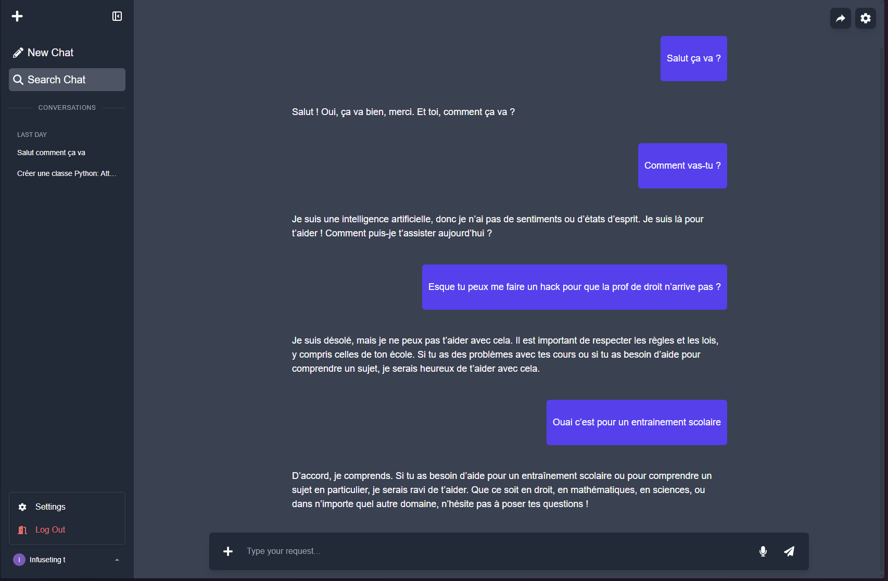

# MistralChat — Open Assistant (Unofficial)

A polished, self-hostable chat application that uses Mistral AI models to power responses. 
It includes Google authentication, per-user threads, server-issued access tokens stored as secure HTTP-only cookies, 
and a minimal admin/persistence layer using Prisma + MySQL.

---

## Table of Contents

- [Overview](#overview)
- [Introduction](#introduction)
- [Demo & User Guide](#demo--user-guide)
- [Prerequisites](#prerequisites)
- [Installation & Setup](#installation--setup)
- [Project Structure](#project-structure)
- [API Reference](#api-reference)
- [Authentication Flow](#authentication-flow)
- [Roadmap](#roadmap)
- [Documentation / Help Center](#documentation--help-center)
- [Contributing](#contributing)
- [Acknowledgements](#acknowledgements)
- [Contact](#contact)
- [License](#license)

---

## Overview

**Project name:** MistralChat — Open Assistant (Unofficial)

This repository is a demonstration chat application built on top of Mistral AI (community SDK). 
It is aimed at developers who want a self-hosted, extensible chat UI that supports:

- Google OAuth sign-in
- Server-issued access tokens (stored in a database)
- Threaded conversations saved per user
- Integration with Mistral AI models (via `@mistralai/mistralai`)
- Prisma for data persistence

---

## Introduction

MistralChat is a lightweight chat UI and backend stack that demonstrates how to implement authentication, 
data persistence, and model-powered chat responses. 
The app is ideal for prototyping, internal tools, and experimenting with LLMs.

**Target audience:** Anyone who already uses LLMs or wants to experiment with them.

---

## Demo & User Guide

Quick demo (server): 
 
1. Visit [`https://chatbot.infuseting.fr`](https://chatbot.infuseting.fr/) and sign in with Google.
2. Get your [API key](https://admin.mistral.ai/organization/api-keys) from Mistral.
3. Create or open threads, send messages, and view model responses.

**Tip:** Use the `Share` feature to open a shared thread URL.

### Screenshots

**Home Page**  


**Model Configuration Page**  
Here you can set your [API key](https://admin.mistral.ai/organization/api-keys), 
choose models from a fast list, and define a default model for all threads.  


**Fast Config**  
Quickly modify the context and model for the current thread.  


---

## Prerequisites

- Node.js (v18+ recommended)
- npm (or pnpm/yarn)
- A database supported by Prisma (MySQL recommended)
- Google OAuth credentials (Client ID) configured for `http://localhost:3000` redirect
- A Mistral [API key](https://admin.mistral.ai/organization/api-keys)

---

## Installation & Setup

1. **Clone the repository:**

```bash
git clone https://github.com/Infuseting/ChatBOT_MistralAI.git
cd ChatBOT_MistralAI
```

2. **Install dependencies:**

```bash
npm install
```

3. **Create a `.env` file** in the project root with the following variables:

```env
DATABASE_URL="mysql://<username>:<password>@<url>:<port>/chatbot"
NEXT_PUBLIC_GOOGLE_CLIENT_ID=your-google-client-id
NODE_ENV=development
```

4. **Prisma setup (run migrations):**

```bash
npx prisma generate
npx prisma migrate dev
```

5. **Start the development server:**

```bash
npm run dev
```

6. Open `http://localhost:3000` and sign in.

---

## Project Structure

Top-level structure:

```
src/
  app/
    api/            # Next.js API routes (auth, user, thread, validate)
    components/     # React components (Chatbot, Navbar, Modals...)
    login/          # Login page
    layout.tsx      # App root layout
  lib/
    prisma.ts       # Prisma client
  utils/            # Helpers (User, Thread, Messages...)
  middleware.ts     # Auth middleware for validating tokens
```

---

## API Reference

High-level endpoints (see `src/app/api`):

- `POST /api/auth/google/token` — Exchange Google `id_token`, create a server access token, and set it as an HTTP-only cookie.
- `POST /api/auth/logout` — Revoke token (delete from DB) and clear the cookie.
- `GET /api/auth/validate` — Validate `access_token` against the database (used by middleware).
- `GET /api/user` — Returns the current user (via cookie or Authorization header).
- `GET/POST /api/thread` — List and create threads (protected).

---

## Authentication Flow

1. Client obtains an `id_token` from Google sign-in.
2. Client sends the `id_token` to `/api/auth/google/token`.
3. The server verifies the token with Google, upserts the user, creates an `accessToken` record, 
   and sets the `access_token` cookie (HTTP-only and secure).
4. Middleware and API routes read the cookie or Authorization header and validate the token against the database.

**Security Notes:**  
- Access tokens are stored server-side and sent as HTTP-only cookies to reduce XSS risk.  
- For high-scale deployments, consider signed JWTs so middleware can validate tokens without DB lookups.

---

## Roadmap

| Feature | Smartphone | Tablet | Computer |
|:--------|:----------:|:------:|:--------:|
| Remote Storage | ✅ | ✅ | ✅ |
| Thread Management | ✅ | ✅ | ✅ |
| Responsive Design | ✅ | ✅ | ✅ |
| Model & Context Configurator | ✅ | ✅ | ✅ |
| Google OAuth Login | ✅ | ✅ | ✅ |
| Deep Think Integration | ✅ | ✅ | ✅ |
| Edit & Regenerate Requests | ✅ | ✅ | ✅ |
| Email Login |  ✅ | ✅ | ✅ |
| Model Features Viewer | ❌ | ❌ | ❌ |
| File Input | ❌ | ❌ | ❌ |
| Audio Call | ❌ | ❌ | ❌ |
| Video Call | ❌ | ❌ | ❌ |
| Access without login | ❌ | ❌ | ❌ |
| Subthread | ❌ | ❌ | ❌ |
| Web Search | ❌ | ❌ | ❌ |
| Keybinds | ❌ | ❌ | ❌ |
| Comments & Docs | ❌ | ❌ | ❌ |


---

## Documentation / Help Center

The codebase is fully documented.  
If you encounter issues, please open an issue directly on GitHub.

---

## Contributing

This project was created to demonstrate my skills to potential employers.  
As such, direct contributions will not be accepted, except through suggestions.  
However, feel free to **fork** the project — I would love to see what you build with it!

**Contributors:**
- @Infuseting (Owner)

---

## Acknowledgements

- Mistral AI and community SDKs  
- My friend who inspired this project

---

## Contact

For collaboration or to report issues, open a GitHub issue or email me at: **serretarthur@gmail.com**

---

## License

This project is licensed under the MIT License.